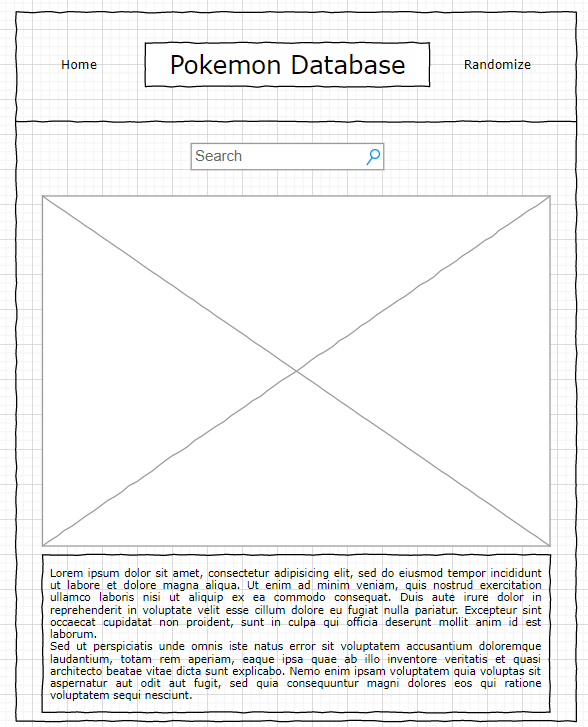

## Starter Pokemon Database

## Project Description

Search and gather specific information about the starter Pokemon (up to Sinnoh).

## API and Data Sample

Using https://pokeapi.co/ as my source for relevant information.

    "abilities": [
        {
            "ability": {
                "name": "blaze",
                "url": "https://pokeapi.co/api/v2/ability/66/"

## Wireframes

Web:

Mobile:

#### MVP 

- Find and use external api 
- Render data on page 
- Allow user to choose specfic Pokemon
- Add images
- Add styling

#### PostMVP

- Add additional styling (i.e., animations)
- Make each starter clickable
- Add the rest of the starters

## Project Schedule

|  Day | Deliverable | Status
|---|---| ---|
|August 14-16| Prompt / Wireframes / Priority Matrix / Timeframes | Complete
|August 17| Project Approval | Complete
|August 18| Core Application Structure (HTML, CSS, etc.) | Complete
|August 19| Initial Clickable Model  | Complete
|August 20| MVP | Complete
|August 21| Presentations | Complete

## Priority Matrix

## Timeframes

| Component | Priority | Estimated Time | Time Invested | Actual Time |
| --- | :---: |  :---: | :---: | :---: |
| Adding Form | H | 4 hrs| 6 hrs | 6 hrs |
| Working with API | H | 8 hrs| 12 hrs | 12 hrs |
| Creating homepage | M | 4 hrs | 6 hrs | 6 hrs |
| Adding each Pokemon | H | 8 hrs | 4 hrs | 4 hrs |
| Adding images for each Pokemon | M | 8 hrs | 8 hrs | 8 hrs|
| Styling | M | 2 hrs | 4 hrs | 4 hrs |
| Total | H | 34 hrs| 40 hrs | 40 hrs |

## Code Snippet

## Change Log

