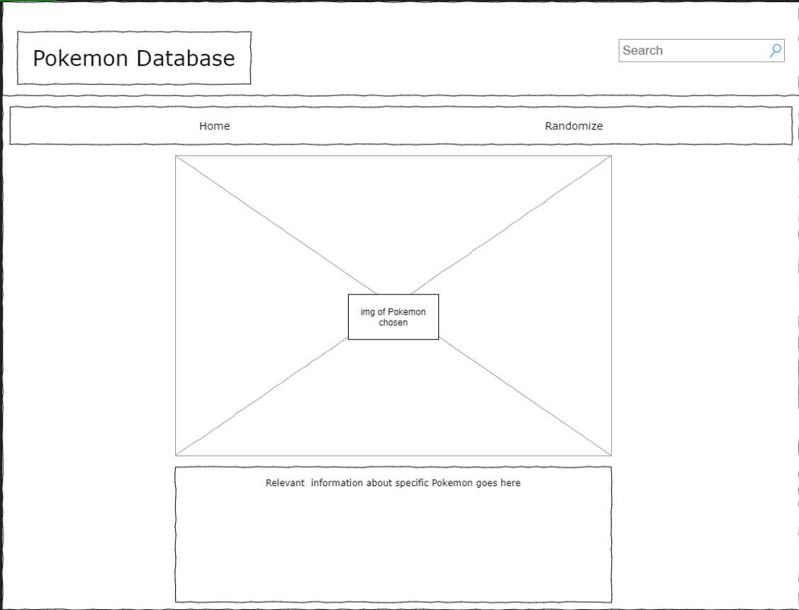

## Pokemon Database

## Project Description

Search and gather specific information about Pokemon from the Sinnoh Region.

## API and Data Sample

Using https://pokeapi.co/ as my source for relevant information.

<!-- const getData = () => {
        P.getPokemonByName("butterfree")
        .then(function(response) {
          console.log(response)
        })
    }
    
    getData() -->

    ^^ Shows that I can get the information needed when I search for Butterfree.

## Wireframes

#### MVP 

- Find and use external api 
- Render data on page 
- Allow user to choose specfic Pokemon
- Add functiong buttons/links
- Add images

#### PostMVP

- Add styling
- Add randomize pokemon button/link
- Add Pokemon from a different region

## Project Schedule

|  Day | Deliverable | Status
|---|---| ---|
|August 14-16| Prompt / Wireframes / Priority Matrix / Timeframes | Complete
|August 17| Project Approval | Complete
|August 18| Core Application Structure (HTML, CSS, etc.) | Incomplete
|August 19| Initial Clickable Model  | Incomplete
|August 20| MVP | Incomplete
|August 21| Presentations | Incomplete

## Priority Matrix

## Timeframes

| Component | Priority | Estimated Time | Time Invested | Actual Time |
| --- | :---: |  :---: | :---: | :---: |
| Adding Form | H | 3hrs| 3hrs | 3hrs |
| Working with API | H | 3hrs| 4hrs | hrs |
| Styling | M | 2hrs | hrs | hrs |
| Adding images for each Pokemon | M | 3hrs | hrs | hrs|
| Total | H | 11hrs| hrs | hrs |

## Code Snippet

## Change Log

