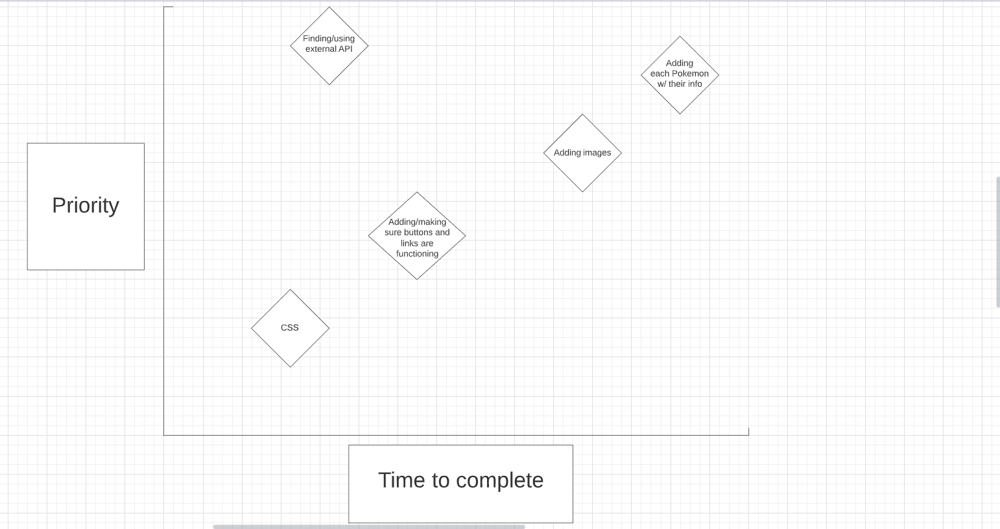

## Starter Pokemon Database

## Project Description

Search and gather specific information about the starter Pokemon (up to Sinnoh).

## API and Data Sample

Using https://pokeapi.co/ as my source for relevant information.

"flavor_text_entries": [
    {
        "flavor_text": "A strange seed was\nplanted on its\nback at birth.\fThe plant sprouts\nand grows with\nthis POKéMON."

## Wireframes

Web:

Mobile:

#### MVP 

- Find and use external api 
- Render data on page 
- Make each starter clickable
- Add styling

#### PostMVP

- Add additional styling (i.e., animations)
- Add images to the information
- Add the rest of the starters

## Project Schedule

|  Day | Deliverable | Status
|---|---| ---|
|August 14-16| Prompt / Wireframes / Priority Matrix / Timeframes | Complete
|August 17| Project Approval | Complete
|August 18| Core Application Structure (HTML, CSS, etc.) | Complete
|August 19| Initial Clickable Model  | Complete
|August 20| MVP | Complete
|August 21| Presentations | Complete

## Priority Matrix

## Timeframes

| Component | Priority | Estimated Time | Time Invested | Actual Time |
| --- | :---: |  :---: | :---: | :---: |
| Adding Form | H | 6 hrs| 6 hrs | 6 hrs |
| Working with API | H | 8 hrs| 12 hrs | 12 hrs |
| Creating homepage | M | 4 hrs | 6 hrs | 6 hrs |
| Adding each starter | H | 8 hrs | 6 hrs | 6 hrs |
| Styling | M | 6 hrs | 8 hrs | 8 hrs |
| Total | H | 32 hrs| 38 hrs | 38 hrs |

## Code Snippet

## Change Log

